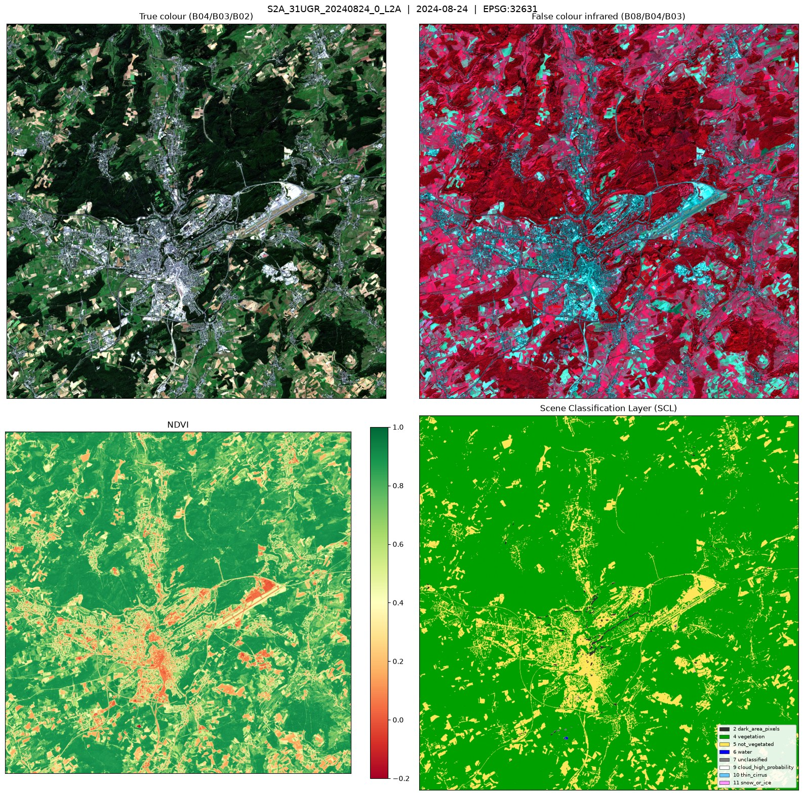
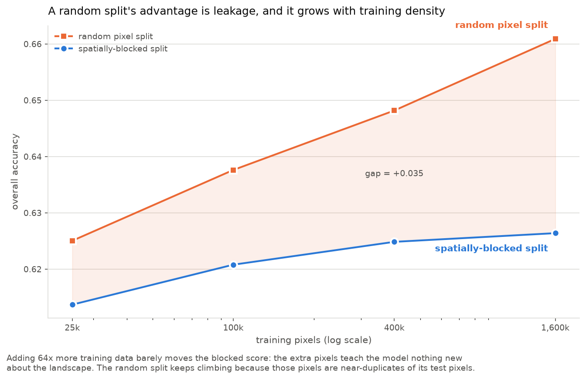
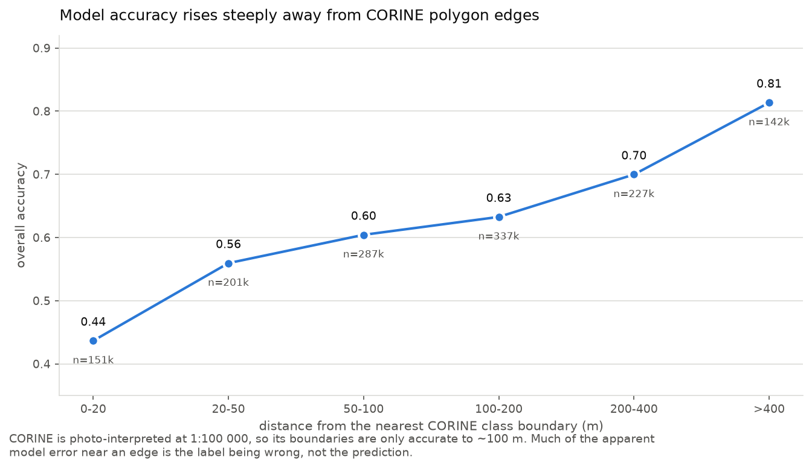
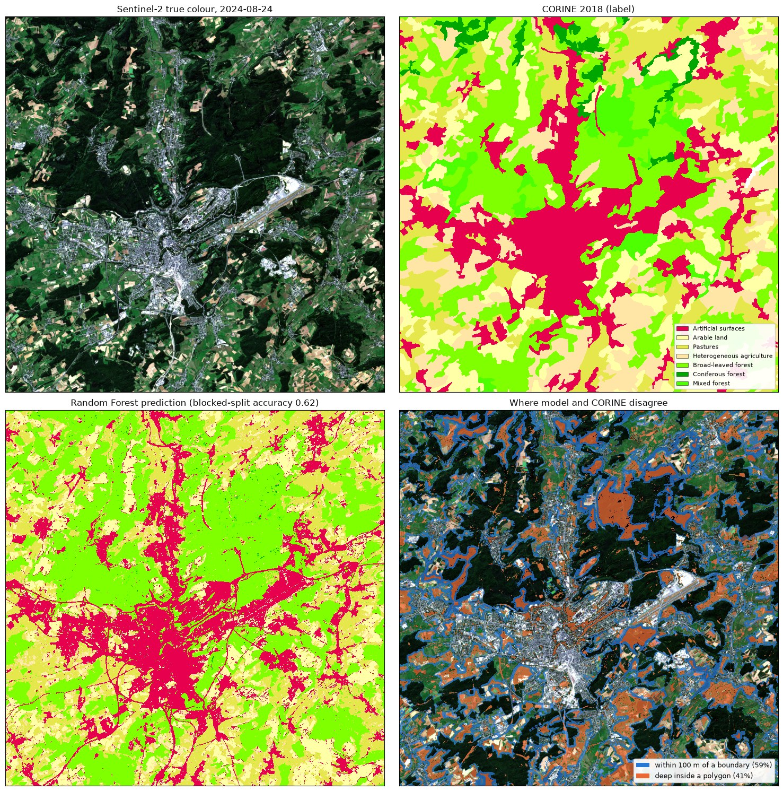
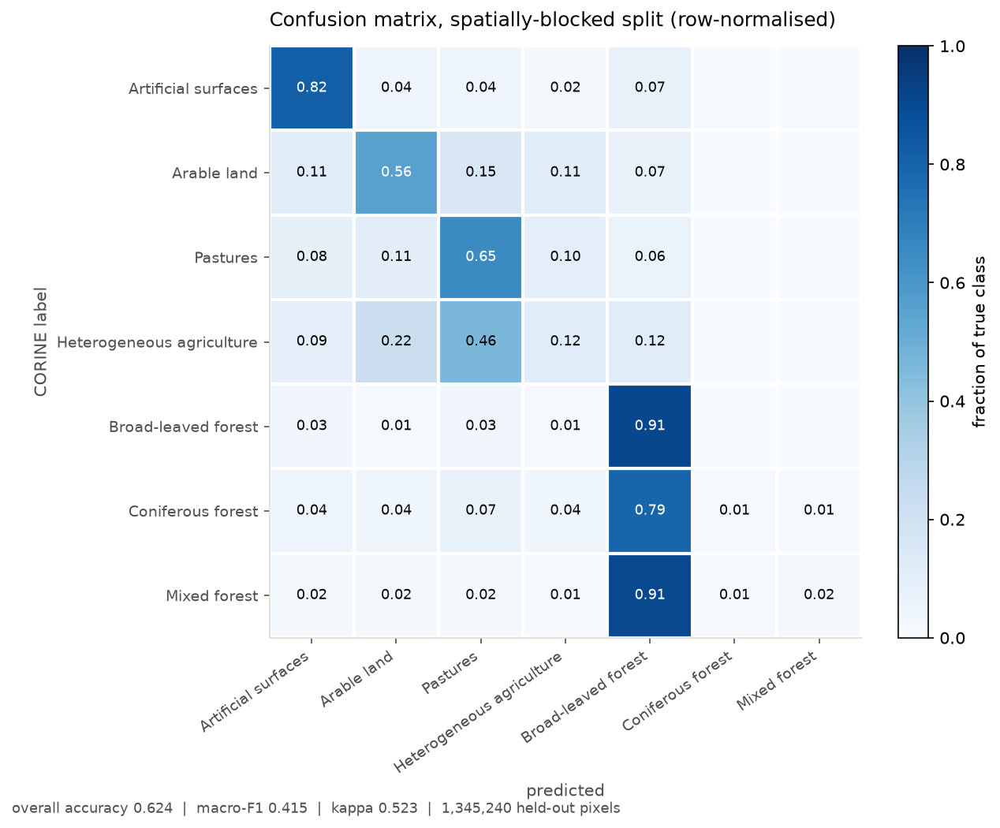
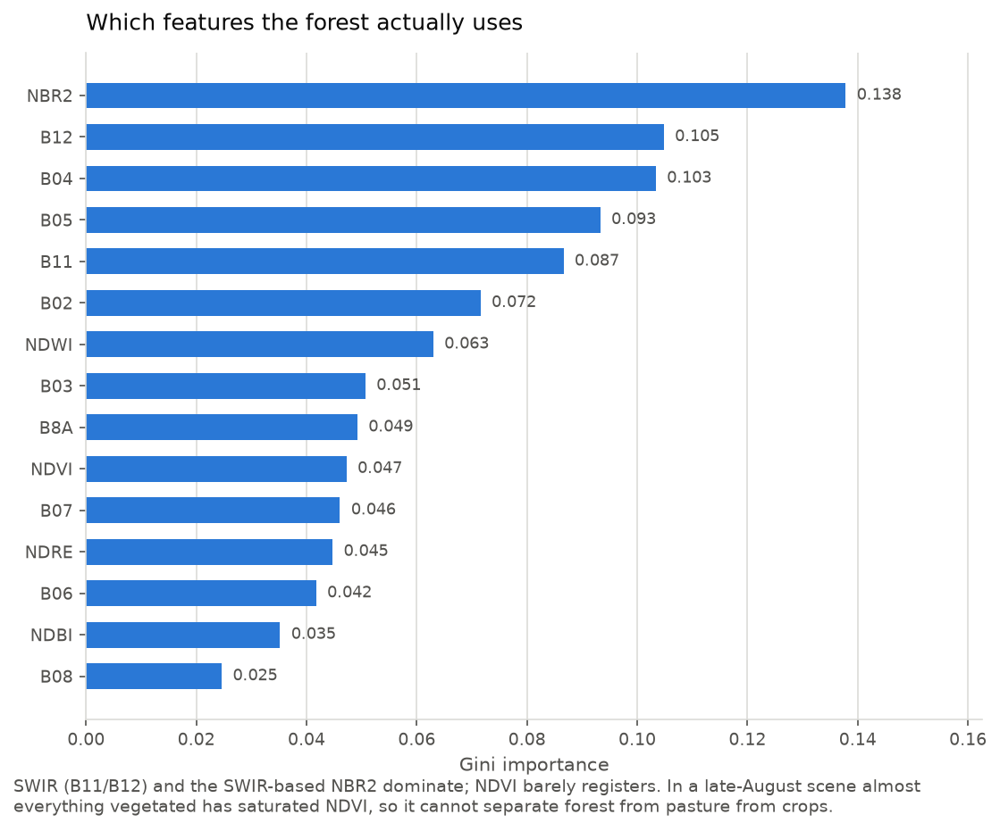
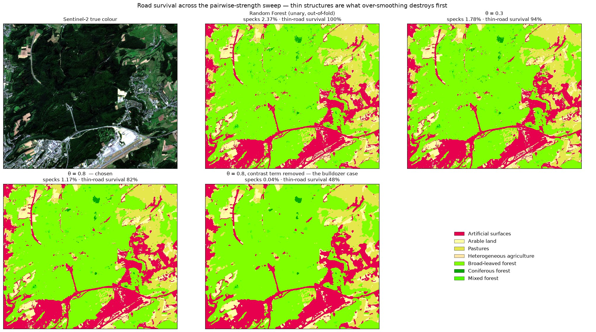
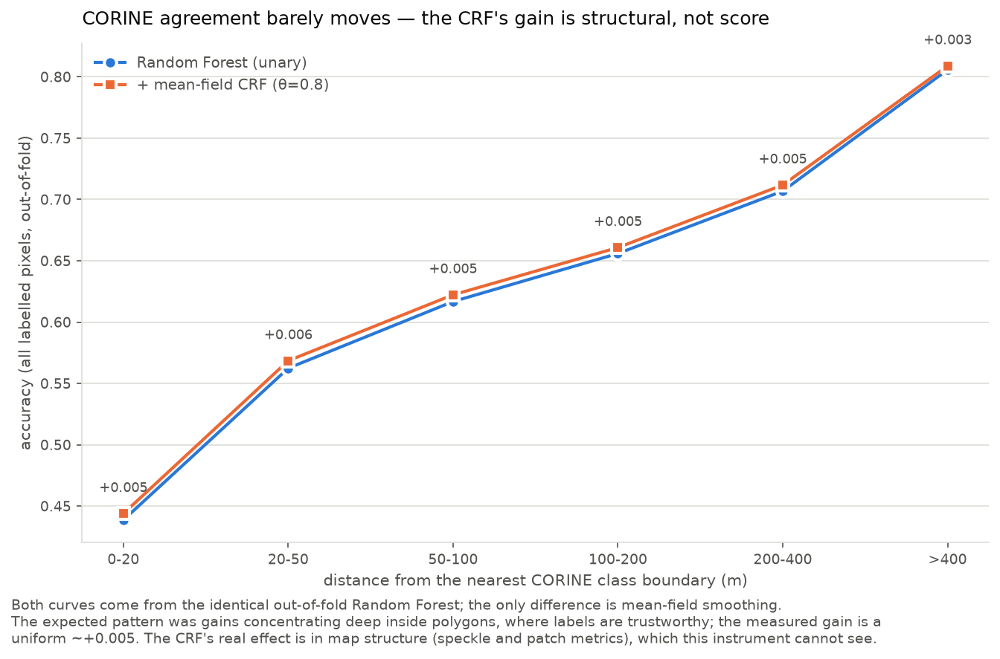
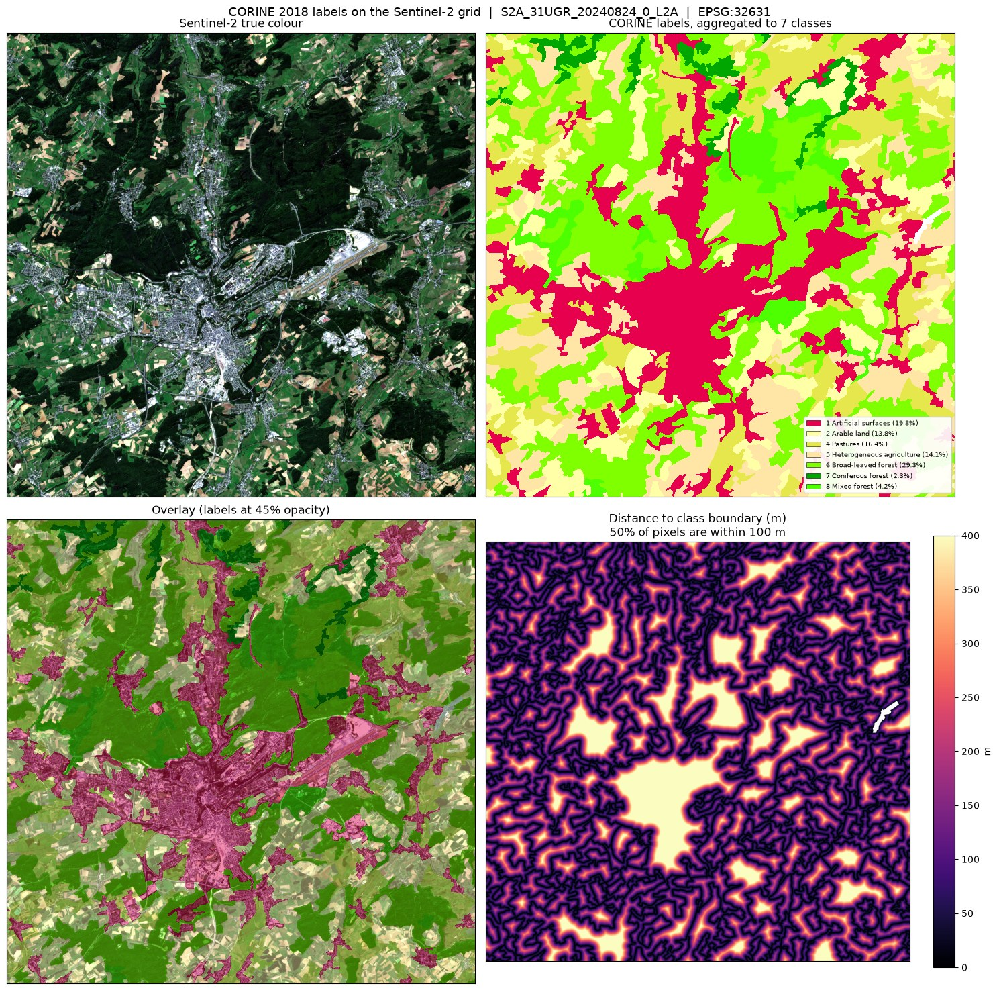

# Sentinel-2 land-cover classification over Luxembourg

An end-to-end land-cover pipeline for a 21 × 21 km window around Luxembourg
City: Sentinel-2 L2A imagery from a STAC API, CORINE Land Cover labels from the
European Environment Agency, a Random Forest evaluated with **spatially-blocked
validation**, and the result loaded into PostGIS for per-commune analysis.



> **What this is.** A self-directed learning project, built in about a week in
> late July / August 2026 to transfer my MSc work on pixel-wise semantic
> segmentation (mean-field networks + CRF, retinal vessel segmentation) onto
> satellite imagery. It is not production work and does not represent prior
> professional Earth-observation experience. It was built with Claude Code
> (agentic development); every design decision in it is one I can defend, and
> the things that went wrong are documented below.

---

## Headline results

Random Forest, 15 per-pixel spectral features, no spatial context, evaluated on
**1.35 million held-out pixels** in spatial blocks the model never saw:

| Metric | Spatially-blocked | Random pixel split |
|---|---|---|
| Overall accuracy | **0.624** | 0.647 |
| Cohen's κ | **0.523** | 0.550 |
| Macro F1 | **0.415** | 0.446 |

The blocked figure is the one to quote. Three findings matter more than the
headline number.

### 1. A random pixel split measures interpolation, not generalisation

Land cover is spatially autocorrelated, and CORINE polygons are at least 25 ha,
so adjacent pixels usually share both their spectrum *and* their label. Split
those at random and nearly every test pixel has a near-duplicate in training.

Sweeping the training set from 25 k to 1.6 M pixels shows exactly that:



| Training pixels | Blocked | Random | Gap |
|---:|---:|---:|---:|
| 25,000 | 0.614 | 0.625 | +0.011 |
| 100,000 | 0.621 | 0.638 | +0.017 |
| 400,000 | 0.625 | 0.648 | +0.023 |
| 1,600,000 | 0.626 | 0.661 | +0.035 |

64× more training data moves the blocked score by 0.012 and the random score by
0.036. The extra pixels teach the model almost nothing new about the landscape;
under a random split they mostly serve as lookups for their own neighbours. Any
single number for "how much leakage costs" would have been an artefact of the
sample size chosen to measure it.

### 2. Most of the residual error is label error, not model error

CORINE is photo-interpreted at 1:100 000 with a 25 ha minimum mapping unit.
**49.5%** of labelled pixels here lie within 100 m of a class boundary — the
scale at which those boundaries are actually accurate.



| Distance to nearest CORINE boundary | Accuracy |
|---|---|
| 0–20 m | 0.437 |
| 20–50 m | 0.559 |
| 50–100 m | 0.604 |
| 100–200 m | 0.633 |
| 200–400 m | 0.700 |
| > 400 m | **0.813** |

Deep inside a polygon, where the label is trustworthy, the same model scores
0.81. The 0.62 headline is substantially a measurement of CORINE's
generalisation, not of the classifier.

The prediction map makes the same point visually — the model resolves the road
network and settlement fingers at 10 m, detail CORINE cannot represent at all,
and is scored down for it:



### 3. Aggregate area agreement is not spatial agreement

From PostGIS, predicted vs CORINE area for artificial surfaces agrees to
**1.5%** (88.6 vs 87.3 km²) — while disagreeing spatially across the whole
scene. A report quoting only per-class areas would look far better than the
classification deserves.

---

## Per-class results, including the failures



| Class | Precision | Recall | F1 | Share of AOI |
|---|---:|---:|---:|---:|
| Artificial surfaces | 0.801 | 0.818 | **0.809** | 19.8% |
| Broad-leaved forest | 0.662 | 0.906 | **0.761** | 29.3% |
| Pastures | 0.488 | 0.650 | 0.556 | 16.4% |
| Arable land | 0.555 | 0.557 | 0.553 | 13.8% |
| Heterogeneous agriculture | 0.286 | 0.116 | **0.165** | 14.1% |
| Mixed forest | 0.464 | 0.021 | **0.039** | 4.2% |
| Coniferous forest | 0.234 | 0.011 | **0.021** | 2.3% |

Three classes fail, each for a different and identifiable reason:

- **Heterogeneous agriculture** (CLC 242/243) is a *mosaic* class — "complex
  cultivation patterns", "agriculture with significant natural vegetation". It
  describes a mixture, not a surface. The confusion matrix shows it going 46% to
  pastures and 22% to arable, which is arguably the model being right about what
  each pixel physically is while being scored wrong.
- **Coniferous and mixed forest** are 2.3% and 4.2% of the area and sit next to a
  class covering 29%. In a single late-August scene, at peak leaf-on, they are
  swallowed by broad-leaved forest (79% and 91% respectively). Multi-date
  imagery — a winter scene, where deciduous canopy is bare and conifers are not
  — is the fix, not a better classifier.
- **Wetlands** were dropped before training: 0.10% of the AOI in a single
  polygon. A class confined to one polygon cannot be evaluated under a
  spatially-blocked split, because it lands entirely inside one fold.

`class_weight='balanced'` was measured rather than guessed: macro F1 rises
0.415 → 0.468 and coniferous recall 0.011 → 0.356, but overall accuracy falls
0.624 → 0.577 and predicted per-class *areas* degrade. The unbalanced model is
kept because area per class is what the PostGIS stage reports.

### What the forest actually uses



SWIR (B11/B12) and the SWIR-based NBR2 dominate; **NDVI barely registers**. In a
late-August scene almost everything vegetated has saturated NDVI, so it cannot
separate forest from pasture from crops. That is an argument for carrying the
20 m SWIR bands rather than defaulting to the 10 m RGB+NIR that convenience
suggests.

---

## Spatial post-processing: the thesis method

My MSc thesis was mean-field networks for retinal vessel segmentation — a
neural unary potential plus mean-field message passing over a CRF. The same
machinery is applied here with the unary swapped for the Random Forest:
a hand-rolled (~90-line, [crf.py](src/postprocessing/crf.py)) **mean-field CRF
with a contrast-sensitive Potts pairwise term** over an 8-neighbour grid,

> w_ij = (θ / d_ij) · exp(−‖f_i − f_j‖² / 2σ²),

with `f` the standardised SWIR/NBR2 features and σ set to the median
4-neighbour feature distance. Where the imagery changes sharply, w_ij collapses
and the CRF leaves the boundary alone — the contrast term is the geospatial
adaptation, and the ablation below shows it is what makes the method usable.

**No leakage:** the unary is the RF's `predict_proba` assembled **out-of-fold**
from a 5-fold spatially-blocked CV ([oof.py](src/models/oof.py)), so no pixel is
smoothed toward probabilities its own training block produced. Sanity check:
OOF argmax accuracy over all 4.39 M labelled pixels is 0.626 — blocked-split
territory, not the leaky 0.647.

| | RF unary | + CRF (θ=0.8) | θ=0.8, contrast term removed |
|---|---:|---:|---:|
| Overall accuracy (all OOF pixels) | 0.626 | 0.632 | **0.647** |
| Patches | 83,868 | 44,828 | 7,589 |
| Pixels in sub-5-px specks | 2.37% | 1.17% | 0.04% |
| Area lost to the 2000 m² speckle filter | 28.9 km² | 15.3 km² | 2.7 km² |
| **Thin-structure (road) survival** | 100% | **82%** | **48%** |



Two findings, both measured rather than asserted:

**1. The gain is structural, not score.** The earlier prediction — that a CRF
would improve the map's appearance more than its CORINE-measured score — is
confirmed: accuracy rises a uniform ~+0.005 at *every* distance from a CORINE
boundary (the expected concentration deep inside polygons did not materialise),
while patch count and speckle drop by half. The area the pre-PostGIS speckle
filter throws away falls **28.9 → 15.3 km²**, which is the commercially
relevant number: per-commune statistics discard half as much classified area.



**2. Agreement with coarse labels is a trap, demonstrated live.** Remove the
contrast term (uniform smoothing at the same θ) and every CORINE-derived
metric *improves* — accuracy 0.647, specks 0.04% — while **half the road
network is erased** (thin-structure survival 48%). CORINE's 25 ha polygons
reward exactly the blobs over-smoothing produces. This is why θ was **not**
tuned on accuracy: the rule is thin-structure survival ≥ 75% (a 3×3-opening
residue tracks roads/railways — class *area* can't, because urban
consolidation masks road loss), then minimum speckle-area loss. Chosen: θ=0.8.

Honest per-class ledger: the five viable classes all gain slightly (pastures
+0.011 F1); the three already-failing ones lose (heterogeneous agriculture
−0.035, coniferous −0.016, mixed −0.009) — smoothing eats minority specks, so
macro-F1 dips 0.418 → 0.413. The CRF makes the map more usable; it does not
rescue classes the single-date spectra cannot separate.

---

## Pipeline

```bash
uv sync                                          # install
uv run python -m src.ingest.sentinel2 --list     # show candidate scenes
uv run python -m src.ingest.sentinel2            # fetch + preprocess (~40 s)
uv run python -m src.ingest.preview              # quicklook figure
uv run python -m src.labels.corine               # CORINE -> 10 m label raster
uv run python -m src.labels.preview              # label/imagery overlay check
uv run python -m src.models.random_forest        # train + evaluate (~5 min)
uv run python -m src.evaluation.figures          # result figures
uv run python -m src.models.oof                  # out-of-fold probabilities (~3 min)
uv run python -m src.postprocessing.crf_pipeline # mean-field CRF sweep + evaluation
uv run python -m src.evaluation.crf_figures      # CRF figures

docker compose -f docker/docker-compose.yml up -d
uv run python -m src.postprocessing.to_postgis   # load + spatial analysis
uv run python -m src.postprocessing.qgis_styles  # QGIS .qml styles
uv run python -m src.postprocessing.web_export   # static web demo -> web/
uv run pytest                                    # 86 tests
```

### 1. Imagery — `src/ingest/sentinel2.py`

Searches the [Element84 Earth Search](https://earth-search.aws.element84.com/v1)
STAC API and reads **only the AOI window** out of the public Cloud-Optimised
GeoTIFFs in `s3://sentinel-cogs` over HTTP range requests. No credentials, and
no 1 GB scene download for a 21 km subset — the whole ingest takes ~40 seconds.

Scene selection requires a single granule to **fully contain** the AOI rather
than mosaicking, so the stack never mixes acquisition dates (and therefore sun
angle and phenology) across the area. Selected: `S2A_31UGR_20240824_0_L2A`,
0.04% cloud, 99.998% valid pixels.

Output: 10 bands (B02–B12, the 20 m bands resampled to 10 m) plus NDVI, NDWI,
NDBI, NDRE and NBR2, as float32 with masked pixels as `NaN`.

### 2. Labels — `src/labels/corine.py`

The Copernicus Land Monitoring Service download portal requires an account, so
the same CLC2018 **vector** product is fetched anonymously from the EEA's public
ArcGIS REST service in its native EPSG:3035, then reprojected and rasterised
onto the imagery grid. CLC level 3 (44 classes) is aggregated to 12, of which 7
occur here.



### 3. Model — `src/models/random_forest.py`, `src/evaluation/`

300 trees, `min_samples_leaf=20`, `max_features='sqrt'`, 300 k training pixels,
no spatial context. Deliberately a pure per-pixel spectral baseline: it answers
"how much land cover is readable straight out of the spectrum?" and leaves a
clean, measurable gap for a convolutional model to close.

### 4. Database — `src/postprocessing/to_postgis.py`, `sql/`

The classified raster is polygonised (6,570 polygons ≥ 2000 m²) and loaded with
the communes, the CORINE reference and the AOI footprint, all in EPSG:32631 so
`ST_Area` returns square metres without a geography cast.

The AOI footprint is a table rather than a comment for a reason: without it,
per-commune areas are quietly wrong. A commune half outside the scene reports
half its true forest with nothing in the output to reveal it, so `commune_aoi`
carries `covered_fraction` alongside every area and the queries filter on it.

Selected output (`data/results/postgis_analysis.txt`):

| Commune | Forest | Built | Forest % |
|---|---:|---:|---:|
| Steinsel | 13.88 km² | 2.81 km² | 66.8% |
| Niederanven | 23.64 km² | 7.61 km² | 60.0% |
| Luxembourg | 14.95 km² | 26.32 km² | 30.4% |

### 5. Interactive demo — `web/`, `src/postprocessing/web_export.py`

A fully static web map (`web/index.html`): swipe between the Sentinel-2 scene
and the classification, or switch to a per-commune forest choropleth with
partially-imaged communes explicitly excluded from the rating. No server, no
tile provider, no external requests — the whole demo is ~2.3 MB of files that
work from any static host. See `web/README.md` for embedding instructions.

The display rasters are warped to Web-Mercator at export time (UTM 31N is
rotated ~2.4° against the Mercator graticule here — overlaying raw UTM pixels
would misplace the corners by hundreds of metres); the analysis rasters stay in
their native CRS.

---

## Design decisions worth defending

**The output CRS is read from the scene, never hardcoded.** Luxembourg straddles
the UTM 31N/32N boundary at 6°E. The obvious answer, EPSG:32632, is *wrong* for
this AOI — only MGRS tile 31UGR (EPSG:**32631**) fully contains it. That is the
kind of assumption that silently produces a shifted map.

**Labels are reprojected to the imagery, not the other way round.** Reprojecting
10 m imagery resamples every pixel and smears exactly the class boundaries the
model is trying to predict. Reprojecting vector polygons is exact up to the
datum transformation, and rasterisation then happens once, deliberately, with
the pixel-centre rule (`all_touched=False`) so adjacent polygons cannot
overwrite each other along shared edges.

**The target grid is snapped to the 10 m band grid with even offsets and
extents,** so the 20 m bands upsample with no sub-pixel shift. Verified by
cross-correlating native B08 against upsampled B8A: the peak sits at exactly
(0, 0) and falls off symmetrically (`tests/test_alignment.py`).

**The BOA reflectance offset is handled explicitly.** From processing baseline
04.00, ESA adds +1000 to L2A reflectance so slightly-negative retrievals survive
unsigned encoding. Earth Search flags whether it already removed it. Getting
this wrong shifts every band by 0.1 reflectance — enough to wreck NDVI and make
two scenes silently incomparable.

**Masked pixels are `NaN`, not 0.** Zero is a plausible reflectance and would be
learned as a feature value.

**Topographic shadow and "unclassified" pixels are kept.** Dropping SCL classes
2 and 7 would systematically remove north-facing slopes and genuinely ambiguous
ground, biasing the training set toward easy pixels and the score upward.

**NDMI was removed after being written.** It is identically `−NDBI`, which would
hand the forest two perfectly anti-correlated features and split its importance
scores across a duplicate. `tests/test_sentinel2.py` now asserts that no index
pair exceeds |r| = 0.99, so it cannot come back.

---

## Limitations

- **Single date.** One August 2024 scene. Coniferous/mixed forest and the
  arable/pasture distinction need multi-date imagery to work properly.
- **Labels are 2018, imagery is 2024.** Six years of real change is scored as
  model error. The "built-up where CORINE is not" query (2.3 km² in Luxembourg
  commune) partly measures that and partly measures CORINE's 25 ha MMU.
- **CORINE's 25 ha MMU.** The median polygon is 78 ha. Rivers, hedgerows and
  individual buildings do not exist in the labels. There is **no water class at
  all** in this AOI — the Alzette is narrower than the MMU.
- **One AOI, one scene.** Nothing here demonstrates generalisation to another
  region or season; the blocked split only demonstrates generalisation to unseen
  ground *within* this scene.
- **No spatial context in the classifier itself.** The RF stays per-pixel; the
  CRF adds spatial context as pure post-processing over its probabilities. A
  model with learned spatial features (a CNN unary) remains future work.
- **Speckle filtering discards area.** Polygons below 2000 m² are dropped before
  loading to PostGIS; the loader reports how much area that removes rather than
  letting the totals silently not add up.

## Not done

- **A CNN/U-Net unary.** The CRF (the thesis machinery) is built and evaluated
  above; swapping its Random Forest unary for a learned convolutional one is
  the remaining stretch goal. The prediction that spatial context would
  "improve the map's appearance more than its CORINE-measured score" has now
  been tested and held for the CRF (+0.005 accuracy, −47% speckle); a CNN
  unary would face the same measurement.
- **QGIS print layout.** Styles are generated (`qgis/*.qml`), a styled project
  exists (`qgis/landcover.qgz`) and the layout steps are documented in
  `qgis/README.md`; the exported map image itself is still to come.

## Data sources and licensing

- **Sentinel-2 L2A** — Copernicus, via AWS Open Data / Element84 Earth Search.
  *Contains modified Copernicus Sentinel data 2024.*
- **CORINE Land Cover 2018** — © European Environment Agency. Copernicus data,
  free and open under Regulation (EU) No 1159/2013.
- **Commune boundaries** — Administration du cadastre et de la topographie, via
  [data.public.lu](https://data.public.lu).

Raw and processed rasters are not committed (see `.gitignore`); every artefact
is reproducible from the commands above.

## Repository layout

```
src/ingest/         STAC search, windowed COG reads, masking, indices
src/labels/         CORINE fetch, reprojection, rasterisation
src/models/         Random Forest baseline + out-of-fold probabilities
src/evaluation/     spatial splitting, metrics, figures
src/postprocessing/ mean-field CRF, PostGIS loading, QGIS styles, web export
sql/                schema + spatial analysis queries
tests/              86 tests (pure logic + integration against a real stack)
docker/             PostGIS container
qgis/               generated .qml styles + layout instructions
web/                static interactive demo (swipe map + choropleth)
```
